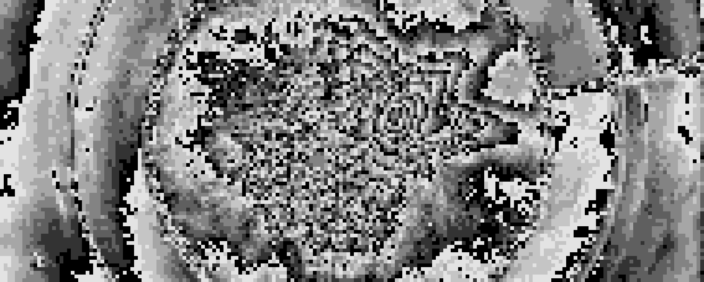

*water_cup_mod_7*

# Archive of Artwork

The complete archive of work can be compiled with

```
git clone git@github.com:henryrobbins/artwork.git
cd artwork
pip install -e assistant
make work
```

Once compiled, an archive directory can be created with

```
make archive
```

Individual series of work can be compiled by navigating to the corresponding
directory and running the python script. This example compiles the mod series.

```
cd mod
python mod.py
```

| Title               | Date       | Directory                                  |
|---------------------|------------|--------------------------------------------|
| spin                | 2021-02-08 | [spin](spin)                               |
| format              | 2021-02-08 | [format](format)                           |
| mother_of_all_demos | 2021-02-24 | [mother_of_all_demos](mother_of_all_demos) |
| color_matrix        | 2021-02-24 | [color_matrix](color_matrix)               |
| polyominoes         | 2021-02-26 | [polyominoes](polyominoes)                 |
| dissolve            | 2021-03-02 | [dissolve](dissolve)                       |
| mod                 | 2021-03-07 | [mod](mod)                                 |
| drunk_walk          | 2021-03-17 | [drunk_walk](drunk_walk)                   |
| partition           | 2021-03-20 | [partition](partition)                     |
| clip                | 2021-03-23 | [clip](clip)                               |
| channel             | 2021-03-29 | [channel](channel)                         |
| resolution          | 2021-04-04 | [resolution](resolution)                   |
| stewart             | 2021-04-14 | [stewart](stewart)                         |
| conway              | 2021-05-02 | [conway](conway)                           |
| steal_your_face     | 2021-05-12 | [steal_your_face](steal_your_face)         |
| weierstrass         | 2021-10-14 | [weierstrass](weierstrass)                 |
| tsp                 | 2021-10-31 | [tsp](tsp)                                 |
| composite           | 2021-12-19 | [composite](composite)                     |
| memory (WIP)        | 2021-01-06 | [memory](memory)                           |

**NOTE:** Work dated between 2021-02-08 and 2021-05-12 was created for
[ART 3699](https://classes.cornell.edu/browse/roster/SP21/class/ART/3699), a
special topics photography class in which the topic was "Images and Algorithms".

## License

All artistic works in this project are licensed under the [Creative Commons Attribution-NonCommercial-NoDerivatives 4.0 International](https://creativecommons.org/licenses/by-nc-nd/4.0/) license, and the underlying source code is licensed
under the [MIT license](LICENSE.md).
